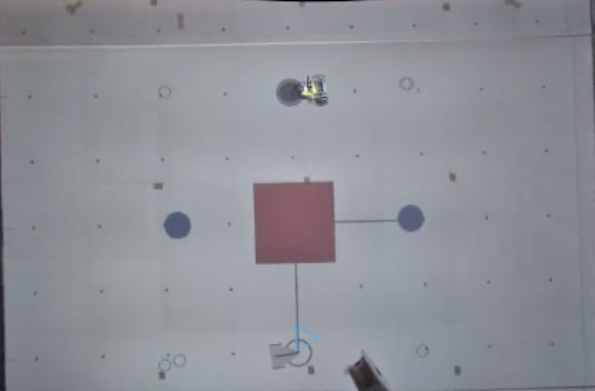

# Reto: Sistema Multiagentes en Robotario

## Introducción

### Overview

El objetivo del reto es generar 2 archivos de texto, donde cada uno definirá una serie de coordenadas (X, Y) que representan una trayectoria o camino. Son 2 archivos de texto, uno para cada robot que existirá en el ambiente. El robot 1 es un robot físico, construido previamente por el Robotario. El robot 2 es un robot simulado, proyectado en el piso del Robotario. Independientemente de ser físico o proyectado, el objetivo es que ambos robots puedan avanzar a través de puntos objetivo determinados al inicio. Para pasar por estos puntos objetivo, el robot deberá atravesar los puntos trayectoria generados. Además, la trayectoria de ambos robots se deberá generar según condiciones iniciales del ambiente donde existen los robots y de manera que ambos nunca colisionen con ningún obstáculo en el ambiente (incluyendo los robots entre sí). Las condiciones iniciales son:

### Condiciones Iniciales

| Descripción                     | Archivo                | Formato                         |
| ------------------------------- | ---------------------- | ------------------------------- |
| Posición inicial de Robot 1 y 2 | `InitialPositions.txt` | x1,x2 y1,y2                 |
| Posiciones objetivo             | `TargetPositions.txt`  | x1,x2,x3,x4 y1,y2,y3,y4     |
| Esquinas de obstáculo           | `Obstacle_{i}.txt`     | x1,x2,x3,x4,… y1,y2,y3,y4,… |

Como se puede ver arriba, podrán existir múltiples archivos de obstáculos según el número de obstáculo $1, 2, 3, \ldots$. Un obstáculo siempre será una figura con 4 lados, como un cuadrado o rectángulo, que tendrá aristas entre los 4 vértices definidos en cada uno de los archivos. Es decir, el archivo `Obstacle_{i}.txt` siempre tendrá 4 puntos $X$ y 4 puntos $Y$, sin excepción.

Respecto a las posiciones iniciales y objetivo, el archivo `InitialPositions.txt` siempre tendrá exactamente 2 pares de coordenadas (x1, y1) y (x2, y2) para cada uno de los robots respectivamente. Además, el archivo `TargetPositions.txt` siempre tendrá minimamente 1 par de coordenadas (x1, y1) y no tiene cota superior en cantidad de posiciones objetivo. Recordar que estas posiciones objetivo son coordenadas por las cuales AMBOS robots tendrán que pasar durante la simulación.

Cada archivo tiene el siguiente formato:

- Fila 1: Posiciones en $X$ separadas por comas
- Fila 2: Posiciones en $Y$ separadas por comas

### Archivos a generar

Los archivos a generar, las coordenadas de la trayectoria de los robots, son los siguientes:

| Descripción             | Archivo          | Formato                                                                  |
| ----------------------- | ---------------- | ------------------------------------------------------------------------ |
| Trayectoria de Robot 1  | `XY_303_1_1.txt` | x1,y1,grupo x2,y2,equipo x3,y3,1 x4,y4,0 x5,y5,0 ... |
| Trayectoria del Robot 2 | `XY_303_1_2.txt` | x1,y1,grupo x2,y2,equipo x3,y3,2 x4,y4,0 x5,y5,0 ... |

El contenido de ambos archivos representa los puntos por los cuales los robots deberán de moverse, considerando que estos puntos esquivan los obstáculos en el plano y buscan pasar por cada posición objetivo.

Siendo la trayectoria generada un conjunto de puntos $T$ (trayectoria) y cada punto objetivo un conjunto de puntos $O$ (objetivo), podemos decir que $O \subseteq T$. Es decir, cada uno de los puntos objetivo deberá encontrarse en la serie de puntos trayectoria generados.

El nombre del archivo se determina en base a:

- Número de grupo de nuestra clase TC2008B
- Número de nuestro equipo en la clase
- Número de robot al que le queremos asignar la trayectoria

Considerando que somos el grupo **303** y el equipo **1**, los nombres de nuestros archivos deberán de ser:

- **XY_303_1_1.txt**
- **XY_303_1_2.txt**

El formato interior a ambos archivos generados es diferente a la de los archivos iniciales. El formato consistirá en un documento separado por comas que contiene exactamente 3 columnas: Posición en $X$, Posición en $Y$, Datos complementarios. Con datos complementarios nos referimos a los datos de grupo, equipo y robot que también se detallan en el nombre del archivo. Es decir, estos datos también deberán encontrarse en el contenido del archivo, en esta 3ra columna. Una vez que se hayan detallado los 3 datos complementarios (grupo, equipo, robot), las filas siguientes (de la fila 4 hacia adelante) únicamente tomarán en valor de $0$ en su lugar, como se puede ver en el ejemplo del formato.

La trayectoria de ambos robots se debe generar considerando la ejecución esperada de todo el sistema:

1. Primero, ambos robots estarán correctamente ubicados en sus posiciones iniciales, tal como se describen en `InitialPositions.txt`.
2. Al ejecutar la simulación del sistema, ambos robots avanzarán a través de cada punto trayectoria de manera simultánea a exactamente la misma velocidad.
3. Durante la ejecución ningún robot deberá colisionar con ninguno de los obstáculos en el ambiente ni entre sí.
4. Durante la ejecución cada robot deberá atravesar cada punto objetivo.
5. La ejecución finaliza cuando cada robot haya pasado por cada uno de los puntos trayectoria generados.

Tal como se menciona arriba, un punto de alta importancia a considerar son las colisiones de los robots con un obstáculo o robot.

### Colisiones entre objetos

Al generar los puntos trayectoria no solamente se deben de considerar las aristas de cada uno de los obstáculos (vértices definidos ya conectados), sino las dimensiones del robot y un pequeño margen de error. Es decir, se debe considerar:

- **Dimensiones del robot**: Ambos robots tienen las mismas dimensiones. A pesar de que el robot no tiene dimensiones cuadradas, deberemos considerar un espacio de colisión posible que sea cuadrado (como un square collider). Las dimensiones de este collider son de $0.18\ m$ de longitud y $0.20\ m$ de altura. Considerando que el robot siempre es colocado inicialmente "viendo" en un ángulo de 90 grados (hacia el norte), las dimensiones iniciales son $(0.18\ m\ X,\ 0.20\ m\ Y)$.

- **Margen de Error**: Debido a que es una prioridad muy alta es no colisionar con ningún robot ni obstáculo, para cada objeto que exista en el ambiente queremos agregar un margen de error de $0.05\ m$. Es decir, siempre se mantendrá esta distancia segura del "square collider" de cada robot a cualquier otro objeto en el ambiente, incluyendo aristas de obstáculos u otros "square collider" de otros robots.

### Visualizando la simulación

Con el objetivo de analizar de manera visual la generación de las trayectorias de los robots, también crearemos figuras en un espacio 2D que simulen la ejecución de los puntos iniciales, los puntos objetivo, los puntos trayectoria, los obstáculos y los robots.

En primer lugar es necesario describir el escenario 2D.

El espacio tiene una altura de $6.5\ m$ y longitud de $6.5\ m$. El fondo del mismo es blanco. Sobre el fondo, existen marcas, puntos negros, a lo largo del plano con el objetivo de tener una mejor perspectiva de las dimensiones del plano. Por ello, los puntos negros están colocados todos en una formación tipo "grid", a $0.5\ m$ de distancia entre cada uno. Existe un punto negro sobre el origen $(0,0)$, desde el cual se designan las posiciones de los demás puntos negros.

Aparte del fondo descrito, también se deben de visualizar los robots y los puntos que existen en el plano:

- Puntos iniciales: Círculos de radio $0.1\ m$, con outline negro y sin fill.
- Puntos objetivo: Círculos de radio $0.1\ m$, sin outline y con fill azul.
- Puntos trayectoria: Círculos de radio $0.025\ m$, con outline negro y sin fill.
- Obstáculos: Polígono formado conectando todos los vértices del mismo, sin outline y con fill rojo.
- Robots: Rectángulo de dimensiones $0.18\ m\times 0.20\ m$, sin outline y con fill gris claro.

Una configuración ejemplo se puede observar en la siguiente imagen:

